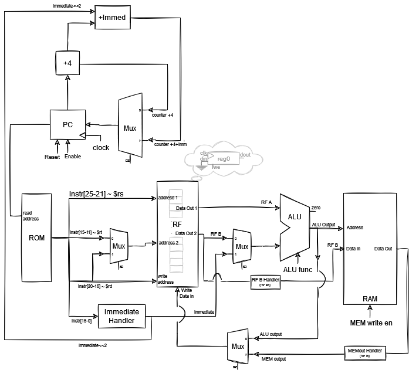

# Simple MIPS processor

As a class project (Low-Level HW Digital Systems I), designed a single-cycle MIPS processor that can execute a set of pre-defined instructions stored in a [ROM](<Verilog Source/program.txt>).

Each submodule shown in the datapath bellow can be found in the Verilog Source directory.

 \
The implented datapath. 
